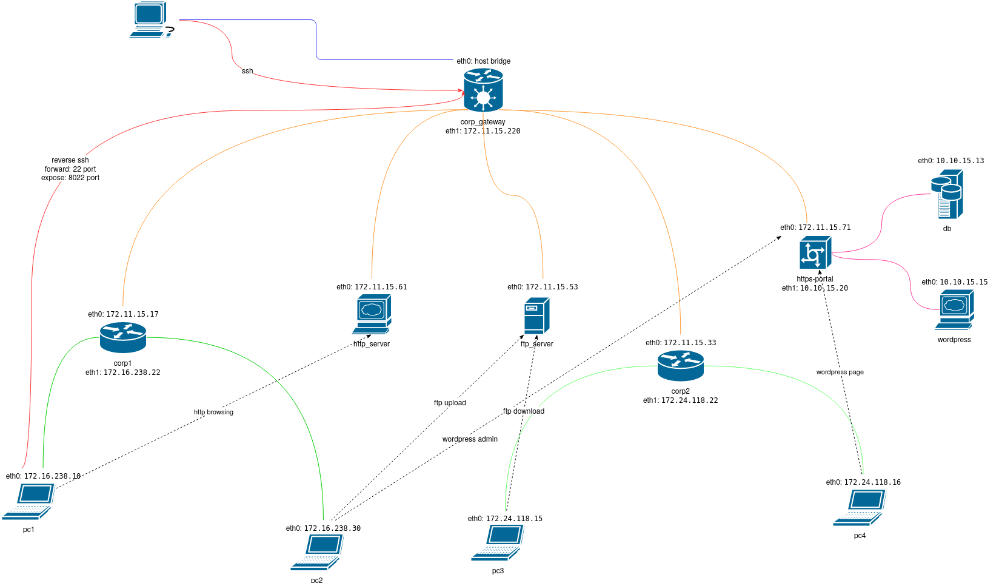

# Computer networks testing lab


Testing lab is a docker based network simulator. It consists of 4 internal subnets with WAN access via gateway and contains routers, workstations and internal services.
**Network topology:**

Available nodes:
- *corp-gateway*: gateway between infrastructure and WAN. There is reverse ssh running to allow access to *client_pc1* node.
- *corp1*, *corp2*: routers that handle two internal subnetworks with groups of client workstations.
- *ftp_server*, *http_server*: internal ftp and http services
- *https-portal*: internal reverse proxy that provides TLS wrapper over *wordpress* (+*db*) service. Also it's accessible internaly via SSH.
- *client_pc1*-*client_pc2*, *client_pc3*-*client_pc4*: two groups of clients workstations. They also periodically simulate clients actions requesting available internal services.

**Disclaimer:** actually, docker-based network simulator has limitations, that may dissalow to perform any network experiments. E.g., if you need to attach one more container, you need to add an appropriate router as new default gateway because docker sets host as default gw. Also, bacause of bridged networks design, you don't need to enable ipv4 forwarding for NAT or spoofing.


# Deployment
- Download and install Workstation Player: https://www.vmware.com/uk/products/workstation-player/workstation-player-evaluation.html
- Download and deploy xubuntu vmware image: https://www.linuxvmimages.com/images/xubuntu-2004/ (Username:Xubuntu, password:xubuntu). You may try use your own distribution.
- Install git:
    ```sh
    sudo apt update ; sudo apt install -y git
    ```
- Clone this repo:
    ```sh
    git clone https://github.com/animant/ftilabs_comnetworks.git
    ```
- Deploy testing infrastructure:
    ```sh
    cd ftilabs_comnetworks
    setup_env.sh
    ```

# Run testing environment

- Run docker based infrastructure:
    ```sh
    start_lab.sh
    ```
- Wait 1-2 minutes
- Now, you can connect to *client_pc1* container via ssh:
    ```sh
    ssh -i ./assets/pc1_access root@127.0.0.1 -p 8022
    ```
- From *client_pc1* you can connect to *https-portal*:
    ```sh
    ssh root@172 .11.15.71 # password: P@ssw0rd
    ```

# TODO
- deploy DNS server
- deploy DHCP server
- implement dynamic IP assignment
- add services with different types of authentications (basic, digest, ntlm, kerberos...)
